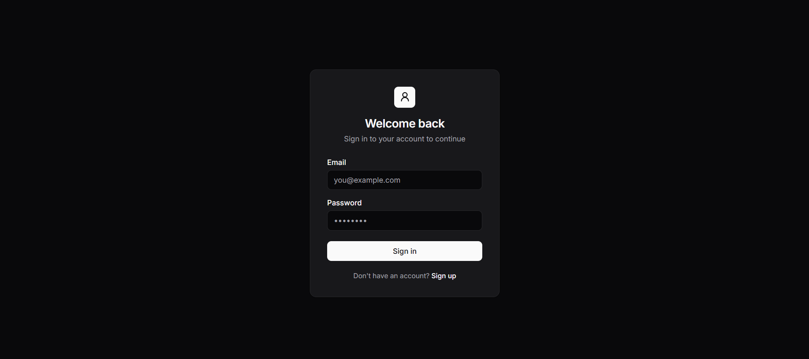
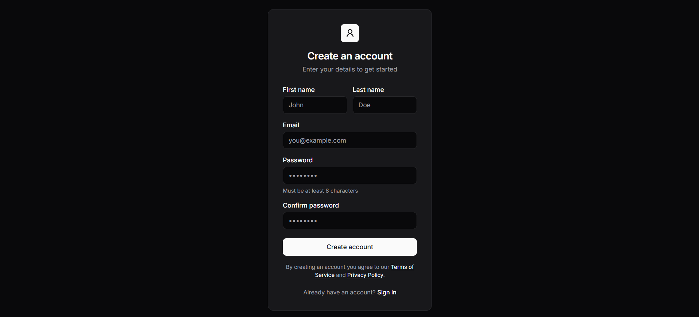
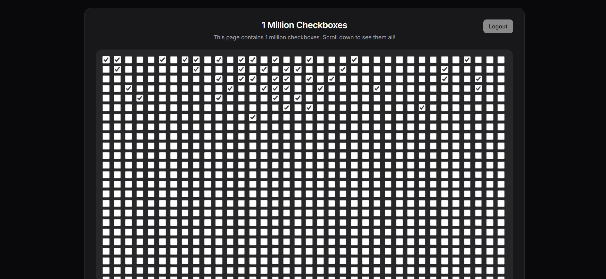

# One Million Checkbox

## 1) Project overview
A small full-stack app that renders a big checkbox grid in the browser and keeps it **in sync in real time** for all connected users.

- The checkbox state is stored in **Redis/Valkey**.
- Clients sync changes over **WebSockets (Socket.IO)**.
- Users are stored in **Postgres** (via **Drizzle ORM**), and checkbox toggles require a valid **JWT access token**.

## 2) Tech stack
- **Backend**: Node.js, Express, Socket.IO
- **Database**: Postgres (Docker), Drizzle ORM + drizzle-kit
- **Cache / realtime state**: Redis-compatible server (Valkey via Docker) + ioredis
- **Auth**: JWT (RS256) + cookies (`cookie-parser`) + password hashing (HMAC-SHA256 + per-user salt)
- **Validation**: Joi
- **Frontend**: Vanilla HTML/CSS/JS served from `public/`

## 3) Features implemented
- User registration + login
- JWT access token (returned to frontend) + refresh token (stored as an httpOnly cookie)
- Logout endpoint (requires access token)
- Persistent checkbox state in Redis (`/checkboxes` returns the current array)
- Realtime checkbox updates broadcast to all clients over Socket.IO
- Socket-level auth for checkbox-change events
- Redis-based rate limiting for checkbox toggles (per-socket)
- OpenID-style discovery endpoints:
  - `/.well-known/openid-configuration`
  - `/.well-known/jwks.json`

## 4) How to run locally
### Prerequisites
- Node.js (recommended: 18+)
- Docker Desktop (for Postgres + Valkey)
- pnpm (recommended, repo includes `pnpm-lock.yaml`) — npm also works

### Step-by-step
1. Install dependencies
   - `pnpm install`

2. Start Postgres + Valkey (Redis-compatible)
   - `docker compose up -d postgresdb valkey`

3. Create your env file
   - Copy `.env.example` to `.env` and adjust values.

4. (Recommended) Generate a stable RSA keypair for JWT signing
   - `bash key-gen.sh`
   
   If you skip this, the server will generate an in-memory keypair on startup (tokens won’t survive restarts).

5. Run DB migrations
   - `pnpm db:generate`
   - `pnpm db:migrate`

6. Start the app
   - `pnpm dev`

### Open in browser
- App UI: `http://localhost:8000/index.html`
- Login UI: `http://localhost:8000/login`
- Signup UI: `http://localhost:8000/signup.html`
- Health check: `http://localhost:8000/health`

### Optional: DB Studio
- `pnpm studio`

## 5) Environment variables required
Create a `.env` at the repo root.

Required:
- `DATABASE_URL` — Postgres connection string (used by Drizzle + app)

Common / recommended:
- `PORT` — server port (default `8000`)
- `NODE_ENV` — set to `production` to make refresh-token cookie `secure`

Checkbox/state:
- `CHECKBOX_COUNT` — number of checkboxes stored/served (defaults to `2000`)
- `CHECKBOX_STATE_KEY` — Redis key name for the checkbox array (default `checkbox_state`)

JWT:
- `JWT_ACCESS_EXPIRES_IN` — access token lifetime (default `15m`)
- `JWT_REFRESH_EXPIRES_IN` — refresh token lifetime (default `7d`)

Notes:
- RSA keys are read from `cert/private-key.pem` and `cert/public-key.pub` (generated by `key-gen.sh`).
- `REDIS_URL` exists in `.env.example`, but the current Redis connection code uses `localhost:6379` directly.

## 6) Redis setup instructions
This repo uses **Valkey** (Redis-compatible) via Docker Compose.

- Start Valkey:
  - `docker compose up -d valkey`
- It exposes port `6379` on localhost.

What Redis is used for:
- The canonical checkbox state array (stored under `CHECKBOX_STATE_KEY`)
- Pub/sub broadcasting between server components (`internal-server:checkbox:change`)
- Rate-limit timestamps per socket (`checkbox_update_time:<socketId>`)

## 7) Auth flow explanation
### Register
1. User submits the signup form (`/signup.html`).
2. Frontend calls `POST /api/auth/register`.
3. Server stores the user in Postgres with:
   - a per-user random `salt`
   - password hashed via `HMAC-SHA256(salt, password)`

### Login
1. User submits the login form (`/login`).
2. Frontend calls `POST /api/auth/login`.
3. Server returns:
   - `accessToken` in JSON response
   - `refreshToken` as an httpOnly cookie named `refreshToken`
4. Frontend stores `accessToken` in `localStorage` as `access_token`.

### Using the access token
- Protected HTTP endpoints expect `Authorization: Bearer <accessToken>`.
- Socket.IO also receives the token via `io({ auth: { token } })`.

### Refresh token
- `POST /api/auth/refresh-token` reads `refreshToken` from cookies and returns a new access token.
- The current implementation verifies the refresh JWT and checks the user exists and has a refresh token recorded.

### Logout
- Frontend calls `POST /api/auth/logout` with `Authorization: Bearer <accessToken>`.
- Server clears the user’s stored refresh token and clears the `refreshToken` cookie.

## 8) WebSocket flow explanation
1. Browser loads `/index.html`.
2. It immediately connects to Socket.IO:
   - `io({ auth: { token: localStorage.getItem('access_token') } })`
3. On page load, it fetches initial checkbox state from `GET /checkboxes`.
4. When a checkbox changes, the client emits:
   - `client:checkbox:change` with `{ index, checked }`
5. Server:
   - authenticates the socket for this event (access token required)
   - rate-limits the event (see below)
   - updates Redis state
   - publishes `internal-server:checkbox:change`
6. Redis subscriber receives the message and the server broadcasts to everyone:
   - `server:checkbox:change` with `{ index, checked }`
7. Each client updates the matching checkbox in the DOM.

Error events used by the UI:
- `server:error:unauthorized` → clears token + redirects to `/login`
- `server:error:rate_limit` → shows a temporary banner

## 9) Rate limiting logic explanation
Rate limiting is enforced server-side for the Socket.IO event `client:checkbox:change`.

- Key: `checkbox_update_time:<socketId>` in Redis
- On each checkbox change, the server reads the last timestamp.
- If the last update was less than **~5.5 seconds** ago, it rejects the change and emits:
  - `server:error:rate_limit`
- If allowed, it stores the new timestamp and applies the change.

This is a simple per-socket throttle to reduce spam and Redis write load.

## 10) Screenshots or demo link
- Demo (local): run `pnpm dev` and open `http://localhost:8000/index.html`.

### Screenshots

